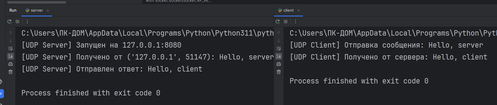
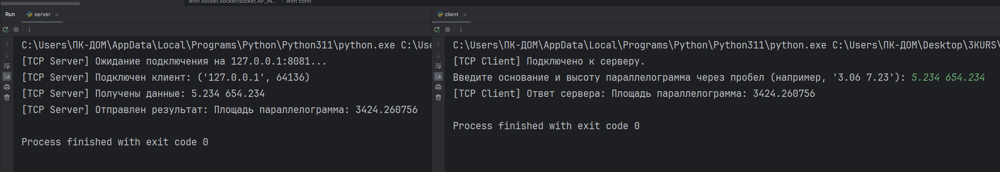
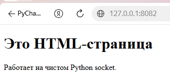
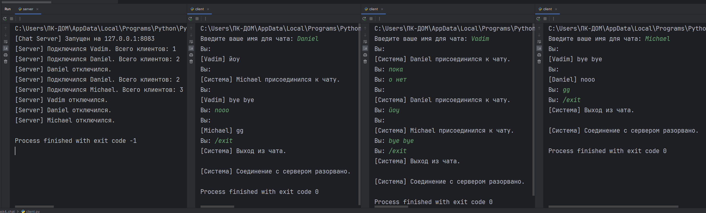
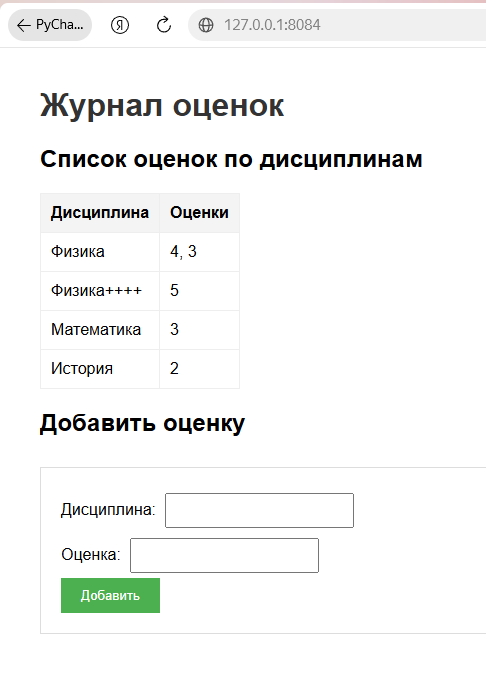
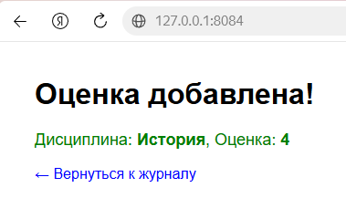
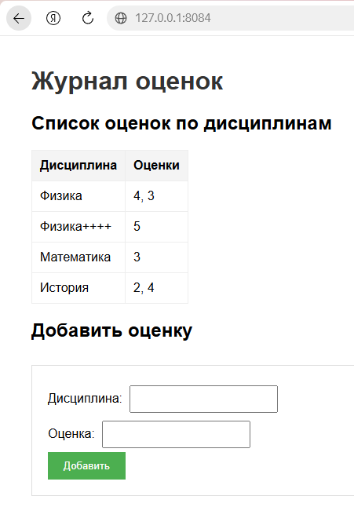

# Лабораторная работа №1. Работа с сокетами

**Студент:** Лукис Вадим Вадимович  
**Группа:** K3342  
**Вариант:** 4 (Площадь параллелограмма)

## Цель работы
Понять принципы межсокетного взаимодейсвтия в вебе. Научиться реализовывать базовую архитектуру клиент-сервер.

---

## Задание 1. Обмен сообщениями по UDP

### Описание
Реализован клиент и сервер на протоколе UDP. Клиент отправляет сообщение «Hello, server», сервер выводит его в консоль и отвечает «Hello, client».

### Код сервера
```python
import socket

HOST = '127.0.0.1'
PORT = 8080

with socket.socket(socket.AF_INET, socket.SOCK_DGRAM) as server_socket:
    server_socket.bind((HOST, PORT))
    print(f"[UDP Server] Запущен на {HOST}:{PORT}")

    data, addr = server_socket.recvfrom(1024)
    print(f"[UDP Server] Получено от {addr}: {data.decode('utf-8')}")

    response = "Hello, client"
    server_socket.sendto(response.encode('utf-8'), addr)
    print(f"[UDP Server] Отправлен ответ: {response}")

```

### Код клиента
```python
import socket

HOST = '127.0.0.1'
PORT = 8080

with socket.socket(socket.AF_INET, socket.SOCK_DGRAM) as client_socket:
    message = "Hello, server"
    print(f"[UDP Client] Отправка сообщения: {message}")

    client_socket.sendto(message.encode('utf-8'), (HOST, PORT))

    data, addr = client_socket.recvfrom(1024)
    print(f"[UDP Client] Получено от сервера: {data.decode('utf-8')}")

```

### Результат работы


---

## Задание 2. Вычисления через TCP

### Описание
Реализован клиент и сервер на протоколе TCP. Сервер вычисляет площадь параллелограмма по формуле S = a * h, где a и h вводятся пользователем с клавиатуры на стороне клиента.

### Код сервера
```python
import socket

HOST = '127.0.0.1'
PORT = 8081

with socket.socket(socket.AF_INET, socket.SOCK_STREAM) as server_socket:
    server_socket.bind((HOST, PORT))
    server_socket.listen(1)
    print(f"[TCP Server] Ожидание подключения на {HOST}:{PORT}...")

    conn, addr = server_socket.accept()
    with conn:
        print(f"[TCP Server] Подключен клиент: {addr}")

        data = conn.recv(1024).decode('utf-8')
        print(f"[TCP Server] Получены данные: {data}")

        try:
            a, h = map(float, data.split())
            area = a * h
            result = f"Площадь параллелограмма: {area}"
        except ValueError:
            result = "Ошибка: введите два числа (основание и высоту) через пробел."

        conn.sendall(result.encode('utf-8'))
        print(f"[TCP Server] Отправлен результат: {result}")

```

### Код клиента
```python
import socket

HOST = '127.0.0.1'
PORT = 8081

with socket.socket(socket.AF_INET, socket.SOCK_STREAM) as client_socket:
    client_socket.connect((HOST, PORT))
    print("[TCP Client] Подключено к серверу.")

    message = input("Введите основание и высоту параллелограмма через пробел (например, '3.06 7.23'): ")

    client_socket.sendall(message.encode('utf-8'))

    data = client_socket.recv(1024).decode('utf-8')
    print(f"[TCP Client] Ответ сервера: {data}")

```

### Результат работы


---

## Задание 3. Раздача HTML-страницы по HTTP

### Описание
Реализован HTTP-сервер на чистых сокетах. При подключении клиента сервер читает файл `index.html` и отдаёт его, формируя корректный HTTP-ответ со строкой статуса, заголовками и телом.

### Код сервера
```python
import socket
import os

HOST = '127.0.0.1'
PORT = 8082

BASE_DIR = os.path.dirname(os.path.abspath(__file__))
HTML_FILE = os.path.join(BASE_DIR, 'index.html')

with socket.socket(socket.AF_INET, socket.SOCK_STREAM) as server_socket:
    server_socket.setsockopt(socket.SOL_SOCKET, socket.SO_REUSEADDR, 1)
    server_socket.bind((HOST, PORT))
    server_socket.listen(1)
    print(f"[HTTP Server] Запущен на http://{HOST}:{PORT}")

    while True:
        conn, addr = server_socket.accept()
        with conn:
            print(f"[HTTP Server] Подключение от {addr}")

            request = conn.recv(1024).decode('utf-8')
            print(f"[HTTP Server] Запрос:\n{request}")

            try:
                with open(HTML_FILE, 'r', encoding='utf-8') as f:
                    body = f.read()

                response_headers = (
                    "HTTP/1.1 200 OK\r\n"
                    "Content-Type: text/html; charset=utf-8\r\n"
                    f"Content-Length: {len(body.encode('utf-8'))}\r\n"
                    "Connection: close\r\n"
                    "\r\n"
                )

                conn.sendall(response_headers.encode('utf-8') + body.encode('utf-8'))
                print("[HTTP Server] Файл успешно отправлен.")

            except FileNotFoundError:
                error_body = "<h1>404 Not Found</h1>"
                response = f"HTTP/1.1 404 Not Found\r\nContent-Length: {len(error_body)}\r\n\r\n{error_body}"
                conn.sendall(response.encode('utf-8'))

```

### Результат работы


---

## Задание 4. Многопользовательский чат

### Описание
Реализован многопользовательский чат на протоколе TCP с использованием библиотеки `threading`. Сервер хранит список подключённых клиентов и рассылает сообщения всем, кроме отправителя. Клиент использует два потока: один для отправки, другой для приёма.

### Код сервера
```python
import socket
import threading

HOST = '127.0.0.1'
PORT = 8083

clients = []
usernames = {}


def broadcast(message, sender_socket):
    """Рассылает сообщение всем клиентам, кроме отправителя."""
    for client in clients:
        if client != sender_socket:
            try:
                client.send(message)
            except:
                client.close()
                remove_client(client)


def remove_client(client_socket):
    """Удаляет клиента из списков."""
    if client_socket in clients:
        clients.remove(client_socket)
        username = usernames.get(client_socket, "Неизвестный")
        del usernames[client_socket]
        print(f"[Server] {username} отключился.")


def handle_client(client_socket):
    """Обрабатывает сообщения от конкретного клиента."""
    try:
        username = client_socket.recv(1024).decode('utf-8')
        usernames[client_socket] = username
        clients.append(client_socket)

        print(f"[Server] Подключился {username}. Всего клиентов: {len(clients)}")
        broadcast(f"[Система] {username} присоединился к чату.".encode('utf-8'), client_socket)

        while True:
            message = client_socket.recv(1024)
            if not message:
                break

            full_message = f"[{username}] {message.decode('utf-8')}".encode('utf-8')
            broadcast(full_message, client_socket)

    except ConnectionResetError:
        pass
    finally:
        remove_client(client_socket)
        client_socket.close()


with socket.socket(socket.AF_INET, socket.SOCK_STREAM) as server_socket:
    server_socket.setsockopt(socket.SOL_SOCKET, socket.SO_REUSEADDR, 1)
    server_socket.bind((HOST, PORT))
    server_socket.listen()
    print(f"[Chat Server] Запущен на {HOST}:{PORT}")

    while True:
        client_socket, addr = server_socket.accept()
        thread = threading.Thread(target=handle_client, args=(client_socket,))
        thread.start()

```

### Код клиента
```python
import socket
import threading

HOST = '127.0.0.1'
PORT = 8083


def receive_messages(client_socket):
    """Поток для постоянного получения сообщений от сервера."""
    while True:
        try:
            message = client_socket.recv(1024).decode('utf-8')
            if not message:
                break
            print("\n" + message)
            print("Вы: ", end="", flush=True)
        except:
            print("\n[Система] Соединение с сервером разорвано.")
            client_socket.close()
            break


username = input("Введите ваше имя для чата: ")

with socket.socket(socket.AF_INET, socket.SOCK_STREAM) as client_socket:
    client_socket.connect((HOST, PORT))
    client_socket.send(username.encode('utf-8'))

    receive_thread = threading.Thread(target=receive_messages, args=(client_socket,))
    receive_thread.start()

    while True:
        message = input("Вы: ")
        if message.lower() == '/exit':
            print("[Система] Выход из чата.")
            break
        client_socket.send(message.encode('utf-8'))

client_socket.close()

```

### Результат работы


---

## Задание 5. Простой веб-сервер (GET/POST)

### Описание
Написан веб-сервер, обрабатывающий GET и POST запросы. 
- **GET**: отдаёт HTML-страницу с таблицей оценок и формой.
- **POST**: принимает данные формы (дисциплина и оценка), сохраняет их в словарь (с группировкой по предметам) и в файл `grades.json`.
HTML-шаблоны вынесены в отдельные файлы для разделения логики и представления.

### Код сервера
```python
import socket
import json
import os
from urllib.parse import unquote

HOST = '127.0.0.1'
PORT = 8084

BASE_DIR = os.path.dirname(os.path.abspath(__file__))
GRADES_FILE = os.path.join(BASE_DIR, 'grades.json')
GRADES_HTML = os.path.join(BASE_DIR, 'grades.html')
SUCCESS_HTML = os.path.join(BASE_DIR, 'success.html')

grades = {}


def load_grades():
    """
    Загружает оценки из файла grades.json при запуске сервера.
    """
    global grades

    if os.path.exists(GRADES_FILE):
        try:
            with open(GRADES_FILE, 'r', encoding='utf-8') as f:
                grades = json.load(f)
            print(f"[Server] Загружено оценок из файла: {len(grades)} дисциплин")
        except Exception as e:
            print(f"[Server] Ошибка чтения файла: {e}")
            grades = {}
    else:
        print("[Server] Файл grades.json не найден, начинаем с пустым журналом")


def save_grades():
    """
    Сохраняет текущие оценки в файл grades.json.
    Вызывается после каждого добавления новой оценки.
    """
    try:
        with open(GRADES_FILE, 'w', encoding='utf-8') as f:
            json.dump(grades, f, ensure_ascii=False, indent=2)
        print(f"[Server] Оценки сохранены в файл")
    except Exception as e:
        print(f"[Server] Ошибка сохранения: {e}")


def read_template(filepath):
    """
    Читает HTML-файл и возвращает его содержимое как строку.
    """
    try:
        with open(filepath, 'r', encoding='utf-8') as f:
            return f.read()
    except FileNotFoundError:
        return f"<h1>Ошибка: шаблон {filepath} не найден</h1>"


def generate_grades_html():
    """
    Генерирует основную страницу журнала оценок.
    Читает шаблон grades.html и подставляет в него таблицу с оценками.
    """
    template = read_template(GRADES_HTML)

    if grades:
        table_html = "<table border='1' cellpadding='5' cellspacing='0'>\n"
        table_html += "<tr><th>Дисциплина</th><th>Оценки</th></tr>\n"

        for subject, marks in grades.items():
            table_html += f"<tr><td>{subject}</td><td>{', '.join(marks)}</td></tr>\n"

        table_html += "</table>"
    else:
        table_html = "<p>Пока нет оценок.</p>"

    final_html = template.replace('{{GRADES_TABLE}}', table_html)

    return final_html


def generate_success_html(subject, grade):
    """
    Генерирует страницу подтверждения после добавления оценки.
    Читает шаблон success.html и подставляет в него название дисциплины и оценку.
    """
    template = read_template(SUCCESS_HTML)

    final_html = template.replace('{{SUBJECT}}', subject)
    final_html = final_html.replace('{{GRADE}}', grade)

    return final_html


def parse_request(request_data):
    """
    Разбирает HTTP-запрос на составные части.
    возвращаем: метод (POST), путь (/), тело (subject=Физика&grade=4)
    """
    headers, _, body = request_data.partition('\r\n\r\n')

    first_line = headers.split('\r\n')[0]

    parts = first_line.split(' ')
    method = parts[0]
    path = parts[1]

    return method, path, body


def parse_post_body(body):
    """
    Разбирает тело POST-запроса.

    Превращает тело (например: subject=Физика&grade=4)
    в словарь (например: {"subject": "Физика", "grade": "4"})
    """
    params = {}

    for param in body.split('&'):
        key, value = param.split('=', 1)

        params[key] = unquote(value)

    return params


def send_response(conn, status_code, status_text, content_type, body):
    """
    Формирует и отправляет HTTP-ответ.
    """
    body_bytes = body.encode('utf-8')

    headers = (
        f"HTTP/1.1 {status_code} {status_text}\r\n"
        f"Content-Type: {content_type}\r\n"
        f"Content-Length: {len(body_bytes)}\r\n"
        "Connection: close\r\n"
        "\r\n"
    )

    conn.sendall(headers.encode('utf-8') + body_bytes)


def handle_client(conn):
    """
    Обрабатывает один HTTP-запрос от клиента.
    """
    try:
        request_data = conn.recv(4096).decode('utf-8')

        if not request_data:
            return

        method, path, body = parse_request(request_data)
        print(f"[Server] Получен запрос: {method} {path}")

        if method == 'GET':
            html = generate_grades_html()

            send_response(conn, 200, 'OK', 'text/html; charset=utf-8', html)
            print(f"[Server] Отдана страница журнала")

        elif method == 'POST':
            params = parse_post_body(body)

            subject = params.get('subject', 'Неизвестно')
            grade = params.get('grade', 'Неизвестно')

            if subject not in grades:
                grades[subject] = []
            grades[subject].append(grade)

            save_grades()

            print(f"[Server] Добавлена оценка: {subject} - {grade}")

            html = generate_success_html(subject, grade)

            send_response(conn, 200, 'OK', 'text/html; charset=utf-8', html)
            print(f"[Server] Отдана страница подтверждения")

        else:
            error_html = "<h1>405 Method Not Allowed</h1><p>Поддерживаются только GET и POST</p>"
            send_response(conn, 405, 'Method Not Allowed', 'text/html; charset=utf-8', error_html)
            print(f"[Server] Неизвестный метод: {method}")

    except Exception as e:
        print(f"[Server] Ошибка обработки запроса: {e}")
    finally:
        conn.close()
        print(f"[Server] Соединение закрыто")


load_grades()

with socket.socket(socket.AF_INET, socket.SOCK_STREAM) as server_socket:
    server_socket.setsockopt(socket.SOL_SOCKET, socket.SO_REUSEADDR, 1)

    server_socket.bind((HOST, PORT))

    server_socket.listen(5)

    print(f"[Web Server] Сервер запущен на http://{HOST}:{PORT}")

    while True:
        conn, addr = server_socket.accept()
        print(f"[Server] Новое подключение от {addr}")

        handle_client(conn)

```

### Структура данных
Оценки хранятся в словаре, где ключ - название предмета, а значение - список оценок:
```json
{
  "Физика": [
    "4",
    "3"
  ],
  "Физика++++": [
    "5"
  ],
  "Математика": [
    "3"
  ],
  "История": [
    "2"
  ]
}
```

### Результат работы




---

## Вывод
В ходе лабораторной работы были изучены принципы работы сетевых сокетов в Python. Реализованы клиент-серверные приложения на базе UDP и TCP, написан собственный HTTP-сервер для отдачи статических страниц и обработки форм, а также создан многопользовательский чат с использованием многопоточности.
